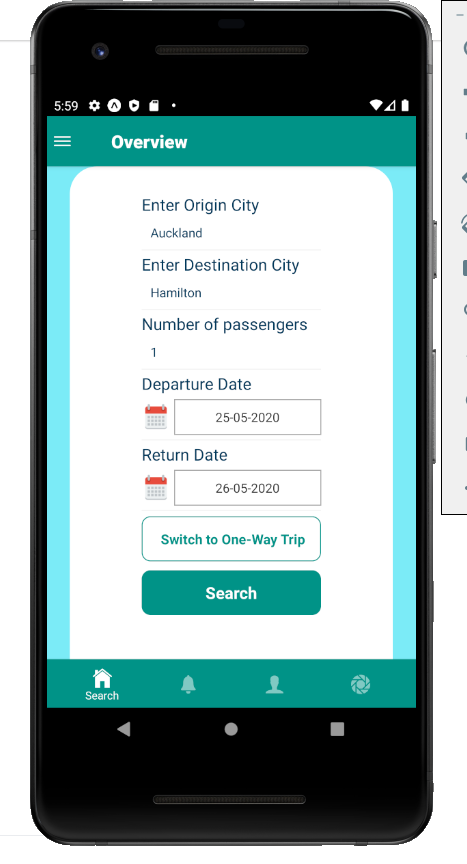
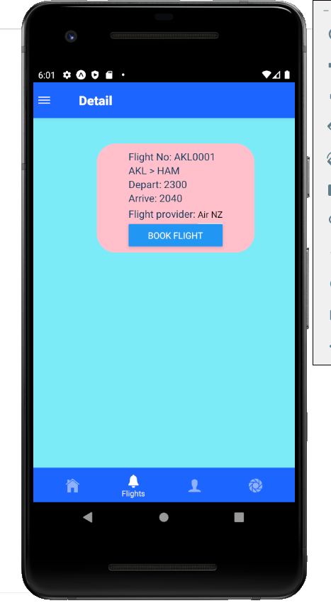

This project is based on Android device.
Run the project:
npm run android  --reset-cache

In this project, I implement two ways of authentications: 
1. using Async storage to login:
    Username: admin
    Password: pass
2. Using SQLite database
    You can sign up and use the new account to login.

https://reactnavigation.org/docs/getting-started/
Install package:
npm install @react-navigation/native
npm install @react-navigation/drawer
npm i react-native-vector-icons
npm install react-native-vector-icons --save
npm install @react-navigation/bottom-tabs

// UI Library
npm install @react-navigation/material-bottom-tabs react-native-paper

npm install react-native-animatable --save
npm run android

// The following import is not suitable for Expo Managed App
//import AsyncStorage from '@react-native-community/async-storage';

//App is Expo Managed (created via expo-cli)
import { AsyncStorage } from 'react-native';

npm install @react-native-community/async-storage --save
react-native link @react-native-community/async-storage

// Not easy one - to be removed
npm i @react-native-community/datetimepicker
// good & easy
npm install react-native-datepicker --save

// not working
npm install react-input-range --save 

npm install axios --save 

npm install react-native-sqlite-storage --save
npm install react-navigation --save
npm install react-native-gesture-handler react-native-safe-area-context @react-native-community/masked-view react-native-screens react-native-reanimated --save

Install dependency:
expo install react-native-gesture-handler react-native-reanimated react-native-screens react-native-safe-area-context @react-native-community/masked-view

// Install sqlite
expo install expo-sqlite
